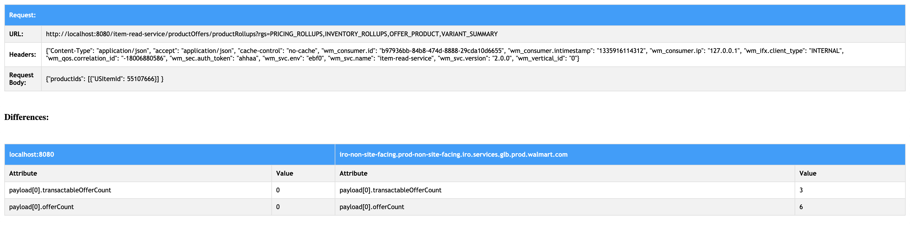

# Parity Test Tool - Python

Run parity test between 2 environments (or hosts) for multiple number of curls, with a single command line statement. 

**Tool usage details:**

We can use single command to generate `curl_*.txt` files and a single command to run parity for all the generated curls.

* As a **pre-requisite**, run the below command: 

```
$ sudo pip install -r requirements.txt
```

**Bulk Parity Execution:**

* To execute bulk parity test for all the testcases, run the below command:

```
$ python bulk_parity.py <HOST_1> <HOST_2>
Example:
$ python bulk_parity.py 'abc-non-site-facing.prod-non-site-facing.abc.services.glb.prod.domain.com' 'localhost:8080'
```
This will run the parity for all the testcases and generate the results in specific sub-folders with pattern `'<REQUEST_TYPE>-<SCENARIO_TYPE>-YYYYMMDD-HHMMSS/'`.

**Selective Parity Execution:**
* To generate the `curl_*.txt` files, run the below command:

```
$ python curl_generator.py <REQUEST_TYPE> <SCENARIO_TYPE> <REQUEST_ID> <OFFER_ID> <POSTAL_CODE> <STORE_IDS>
-- <REQUEST_TYPE>: enumerator of "Regular", "Variant", "Bundle" or "BVShell".
-- <SCENARIO_TYPE>: enumerator of "Positive", "Negative" or "Store".
-- <REQUEST_ID>: can be specified with label PRODUCT_ID="sampleProductId" or US_ITEM_ID="sampleUSItemId". If no label is provided REQUEST_ID is considered to be US_ITEM_ID by default.
-- <STORE_IDS>: can be optionally specified. Use comma separated values if more than one store_id needs to be specified.
Example: 
$ python curl_generator.py Regular Negative 48319962 "06DEDE4C806C4B33B15CB348ACC6AFF6" "90001"
$ python curl_generator.py BVShell Store "PRODUCT_ID=3HD11CXDBNLK" "D3409E9E783F4F29B9EEE2B3B8801492" "90001" 2280
$ python curl_generator.py Variant Store "US_ITEM_ID=55107666" "D3409E9E783F4F29B9EEE2B3B8801492" "90001" 2280,1122,2239
```
The above script will create `curl_*.txt` files in a sub-folder of syntax: `'<REQUEST_TYPE>-<SCENARIO_TYPE>-YYYYMMDD-HHMMSS/'`. 

Additionally, you can add-on your own curl files. Just create the filename with the pattern: `curl_req_*.txt` and add `$HOST` keyword for the hostname in the curl, so that the hostname gets dynamically picked up for parity. For better management, create these curl files in a sub-folder within the current directory.

* Once the `curl_*.txt` files are generated in the sub-folder, use the below command to run the parity for all curls:

```
$ python parity_checker.py <SUB_FOLDER_NAME> <HOST_1> <HOST_2>
Example:
$ python parity_checker.py 'Regular-Negative-20200127-175720' 'abc-non-site-facing.prod-non-site-facing.abc.services.glb.prod.domain.com' 'localhost:8080'
```
You should find HTML reports generated in the same sub-folder with filename syntax: `parity_results-curl_req*.html`

* We can also specifically run parity for single `curl_*.txt` file. Use the below command:

```
$ python parity_checker.py 'Regular-Negative-20200127-175720' 'curl_req_1.txt' 'abc-non-site-facing.prod-non-site-facing.abc.services.glb.prod.domain.com' 'localhost:8080'
```

** Sample HTML report: **

